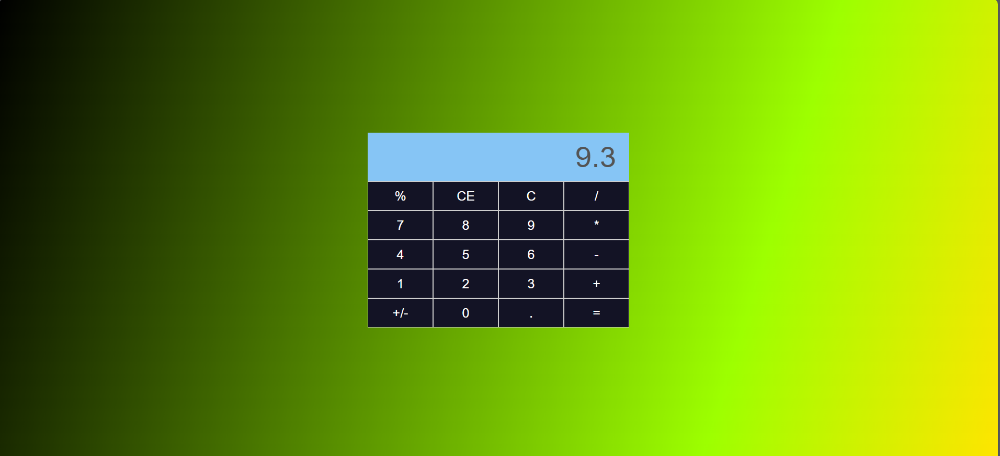

# 🧮 React Calculator App

A simple, responsive calculator built with **React** that supports basic arithmetic operations, keyboard input, percentage calculation, and toggling positive/negative values.

## 🚀 Features

- Basic operations: Addition, Subtraction, Multiplication, Division
- Toggle sign (`+/-`) of the current number
- Percentage calculation (context-aware)
- Decimal support (with keyboard or UI input)
- Keyboard input support (Enter, Escape, numbers, operators, etc.)
- Clear and reset functions (`C`, `CE`)

## 🖥️ Preview



## 📦 Tech Stack

- [React](https://reactjs.org/)
- [styled-components](https://styled-components.com/)
- JavaScript (ES6+)


## ⌨️ Keyboard Support

| Key         | Action              |
|-------------|---------------------|
| 0–9         | Type numbers         |
| `+ - * /`   | Set operator         |
| `.`         | Add decimal          |
| `Enter` / `=` | Evaluate expression |
| `Backspace` / `Delete` / `Escape` | Clear display |
| `%`         | Calculate percentage |

## 🔧 Setup & Run Locally

1. **Clone the repo**
   ```bash
   git clone https://github.com/yourusername/react-calculator.git
   cd react-calculator
    ```

2. **Install dependencies**

   ```bash
   npm install
   ```

3. **Start the development server**

   ```bash
   npm start
   ```

## 🧪 Tests

> No tests added yet — PRs welcome!

## 📄 License

MIT License © 2025 \[Your Name]

---

Feel free to customize this project or contribute. PRs and suggestions are welcome!


Let me know if you want help generating a live demo link (e.g., via Vercel or Netlify) or adding images/screenshots!
